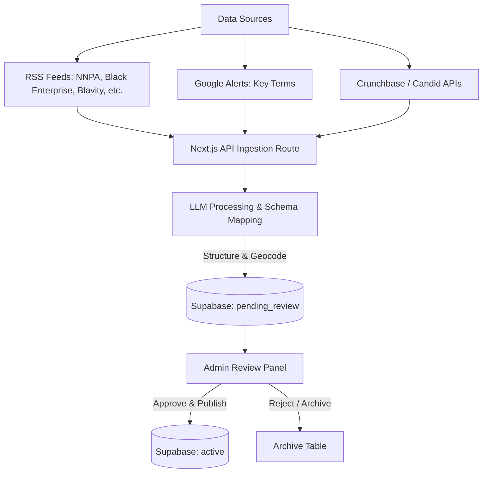

# 📊 Proposal: Data Collection & Pipeline Automation

This proposal outlines the strategy for expanding the Black America Dashboard's dataset to 200–500 records and building an automated refresh pipeline.

---

## 🗺️ Architectural Flow

Below is the proposed workflow for automating data collection, structuring it via LLMs, and publishing it to the dashboard after human moderation.

---

## 🎯 Why This Strategy is Critical

1. **Combating Coastal & Tech-Only Bias:** National platforms (TechCrunch, Crunchbase, general news) primarily spotlight venture-backed, high-tech startups in major hubs (SF, NY). Local papers (such as the *Chicago Defender*, *Houston Forward Times*, *LA Sentinel*, etc.) capture the grassroots, local fintech, community-led programs, and regional leadership that form the true foundation of economic empowerment.
2. **From Prototype to Authority:** A map with 25 records is a proof-of-concept. A map with 200–500 curated records representing every state is a resource that journalists, researchers, and policymakers can rely on.
3. **Low-Maintenance Longevity:** Manually searching and entering data is a recipe for project rot. Automating the ingestion ensures the dashboard stays current through 2026 without constant developer hours.

---

## 🛠️ How We Will Implement It

To preserve speed-to-market while keeping code maintainable, we propose a three-phased roll-out:

### Phase 1: Curated Seed Expansion (Immediate)
* **Goal:** Reach 200+ high-quality records representing the target publications and state-by-state layer.
* **Mechanism:**
  * We will compile a structured dataset of 150–200 entries focusing on regional coverage (e.g., IL achievements from *Chicago Defender*, TX achievements from *Houston Forward Times*, etc.).
  * We will write a batch import command in `src/scripts/seed-supabase.ts` that safely merges this new seed data into the live Supabase instance without duplicating existing entries.

### Phase 2: Semi-Automated RSS Feed & LLM Pipeline (Medium Term)
* **Goal:** Pull new articles automatically and convert them into structured entries.
* **Mechanism:**
  * **API Route:** Create `src/app/api/ingest/rss/route.ts` that runs on a schedule (e.g., via Vercel Cron).
  * **RSS Parser:** Fetch and parse feeds from the NNPA, Black Enterprise, Blavity, Essence, and The Grio.
  * **LLM Entity Extraction:** Pass the extracted articles to the Gemini API (using a structured schema prompt) to:
    * Map the story to one of the 5 categories.
    * Extract coordinates (latitude/longitude) based on the city/state.
    * Generate a clean 1-2 sentence summary, leaders, and tags.
  * **Draft Stage:** Write these entries to the Supabase database with a `status = 'pending_review'` flag.

### Phase 3: Admin Review Portal & API integrations (Long Term)
* **Goal:** Provide a secure interface to review pending data and integrate Crunchbase/Candid.
* **Mechanism:**
  * **Admin UI:** A simple `/admin` route in Next.js protected by Supabase Auth where administrators can view, edit, approve, or reject incoming drafts.
  * **Crunchbase & Candid Integration:** Connect to the Crunchbase Basic API and Candid Essentials API for quarterly data syncs. Since Candid handles nonprofit status, this is ideal for automating the *Grassroots* and *Community Advancement* categories, while Crunchbase automates the *Startups* layer.

---

## 📋 Recommended Action Plan

If you approve this plan, we will proceed with:
1. **Splitting Milestone 8** in [PLAN.md](file:///c:/Innov8Edge/Projects/Black%20America/PLAN.md) into specific task items matching this proposal.
2. **Drafting the Phase 1 script** to safely expand the seed data model.
3. **Proposing the file structure** for the Next.js RSS parser.
